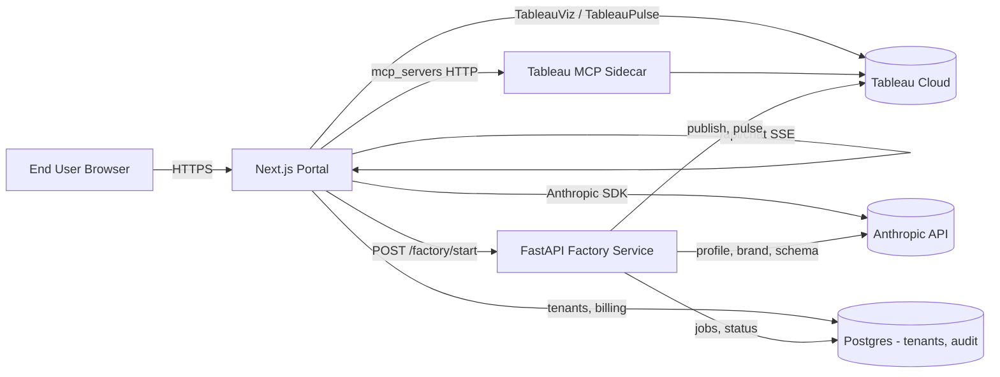
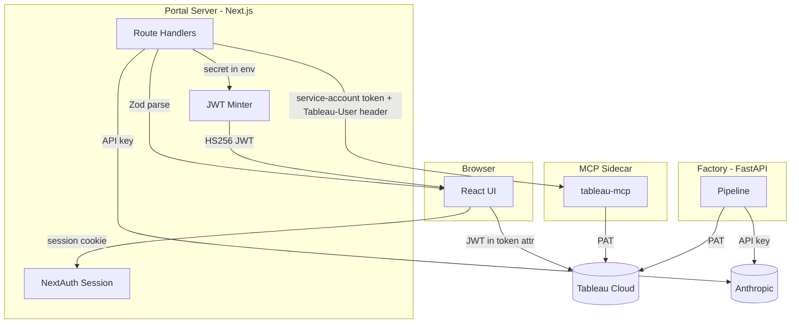
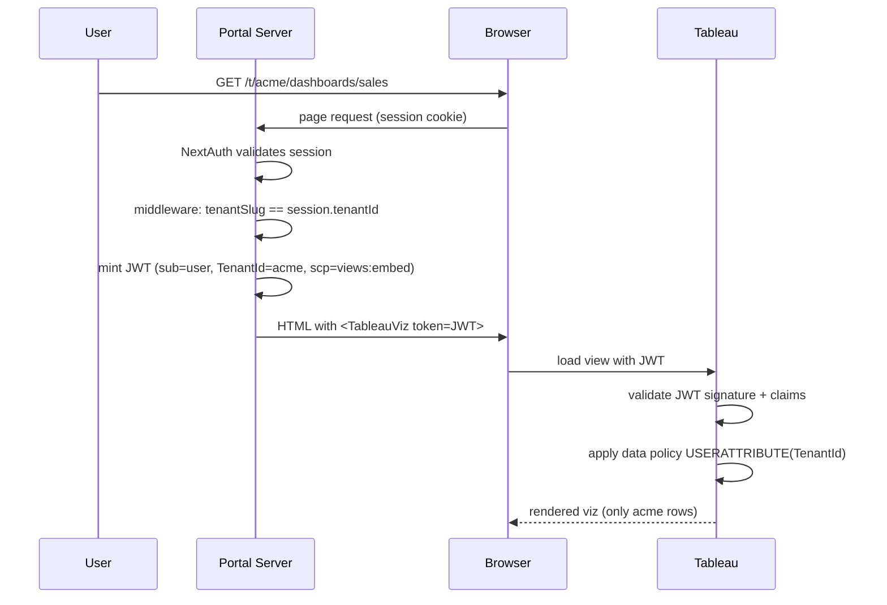
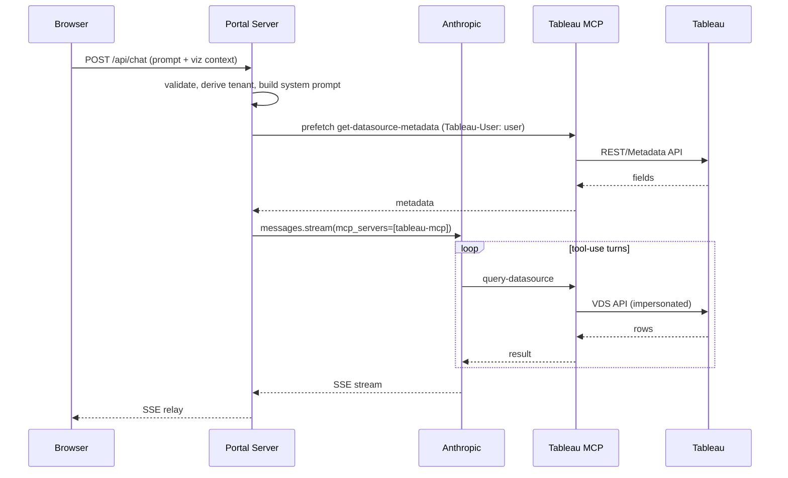

# Architecture Overview

## High level



## Components

| Component | Path | Tech | Role |
| --- | --- | --- | --- |
| Portal | `apps/web/` | Next.js 15, React 19, TS strict | UI shell, embed, chat, factory UI |
| Factory | `services/factory/` | Python 3.12, FastAPI | Pipeline: scrape → profile → generate → publish |
| MCP sidecar | external | `@tableau/mcp-server` in Docker | Exposes Tableau APIs to the agent |
| Tableau Cloud | external | Tableau Cloud (UBL) | Hosts data, workbooks, Pulse |
| Anthropic | external | Claude (Messages API + MCP) | LLM |
| Postgres | `infra/` | Postgres 16 | Tenants, audit log, factory jobs |

## Repository layout

```
apps/
  web/                              # Next.js portal (Phase 1+)
services/
  factory/                          # Python sidecar (Phase 7+)
packages/
  tableau-jwt/                      # JWT minter (Phase 2)
  mcp-tools/                        # MCP tool wrappers + allowlist (Phase 3)
  factory-schema/                   # Shared TS/Python types (Phase 7)
infra/
  docker-compose.yml                # web + factory + tableau-mcp + postgres
docs/
  adr/                              # Architecture decisions
  architecture/                     # Diagrams, this file
  runbooks/                         # Operational runbooks
.claude/                            # Claude project foundation (Phase 0)
.cursor/                            # Cursor rules
```

## Trust boundaries



Key invariants:

- Anthropic API key and Tableau PATs **never leave the server**.
- The JWT minted for the browser contains the end-user identity + tenant — Tableau enforces RLS based on it.
- The MCP sidecar uses a service-account PAT but forwards `Tableau-User` for per-user RLS — the LLM cannot escape RLS by crafting tool args.
- Factory pipeline is server-to-server only; no browser access.

## Data flow: viewing a dashboard



## Data flow: AI chat turn



## Where to look next

- ADRs: `docs/adr/`
- Setup: `docs/runbooks/`
- Skills (on-demand context for agents): `.claude/skills/`
- Cursor/Claude project conventions: `AGENTS.md`
