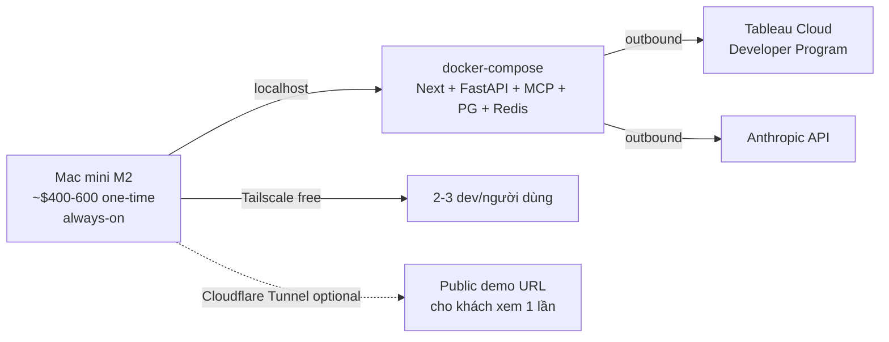

# Chạy `tableau-ai-portal` 100% Trên Máy Local

> Đây là cách nhanh và rẻ nhất để dùng dự án cho **dev cá nhân / dogfood / demo nội bộ** — toàn bộ stack chạy trên máy bạn, chỉ 2 thứ bắt buộc online là **Tableau Cloud** (có Developer Program free 1 năm) và **Anthropic API**. Tổng chi phí thực tế ~$5–30/tháng tùy mức sử dụng Anthropic.
>
> Nếu cần production / khách trả tiền, đọc [`rollout-production-lean.md`](./rollout-production-lean.md) hoặc [`rollout-production-full.md`](./rollout-production-full.md).

---

## 1. Use case nào phù hợp với local-only?

| Use case | Local OK? |
|---|---|
| Dev cá nhân / dogfood / học | ✅ **Cực kỳ phù hợp** |
| Demo cho đồng nghiệp qua LAN / Tailscale | ✅ OK với 1 vài tweak |
| Team nhỏ dùng nội bộ "always-on" trên 1 Mac mini / NUC | ⚠️ Tạm ổn nhưng laptop-grade availability |
| Bán/show cho khách trả tiền | ❌ Không — tier Hobby VPS ($30/tháng) thay vào |

---

## 2. Cái gì chạy local, cái gì bắt buộc online?

### Chạy 100% local

| Thành phần | Local cmd | Cổng |
|---|---|---|
| Next.js portal | `pnpm dev` (hoặc `pnpm build && pnpm -F @portal/web start`) | `:3000` |
| Python factory (FastAPI + Hyper API) | `cd services/factory && uv run uvicorn app.main:app --reload --port 8000` | `:8000` |
| Tableau MCP sidecar | `docker compose -f infra/docker-compose.yml up tableau-mcp` | `:8081` |
| Postgres (khi muốn migrate khỏi in-memory) | thêm service Postgres vào `infra/docker-compose.yml` | `:5432` |
| Redis (tùy chọn) | thêm service Redis vào `infra/docker-compose.yml` | `:6379` |

Code hiện tại có **fallback graceful** cho từng dependency:
- Tableau credentials chưa cấu hình → factory stages `publish`, `pulse` emit `skipped` thay vì fail.
- Anthropic key chưa cấu hình → `/api/chat` trả error SSE rõ ràng; factory `profile.py` dùng fallback Retail profile (xem `services/factory/app/profile.py`).
- Hyper API thiếu binary → stage `hyper` emit `skipped`.

Đã được verify trên macOS (darwin 25.4.0) ở Phase 7 — factory tạo `.hyper` thật trong ~1s với 230K rows.

### Bắt buộc online (SaaS)

| Dịch vụ | Tại sao bắt buộc | Free tier |
|---|---|---|
| **Tableau Cloud** | Không có "Tableau local" — toàn bộ embed JWT, Connected App, Pulse API đều phụ thuộc | **Tableau Developer Program** free 1 năm tại [developer.salesforce.com/free-trial/tableau](https://www.tableau.com/developer) — full Creator features |
| **Anthropic API** | Không có Claude local (Ollama không tương thích với MCP `mcp_servers` + tool_use chuẩn) | Pay-as-go, đặt hard cap $20–50/tháng trong console |

---

## 3. Setup local — checklist nhanh

### 3.1. Đăng ký tài khoản (1 lần, ~30 phút)

1. **Tableau Developer Program**: đăng ký tại link trên. Sau khi được duyệt (vài giờ tới vài ngày), bạn có 1 site Tableau Cloud với role Creator full quyền.
2. **Anthropic Console**: đăng ký tại [console.anthropic.com](https://console.anthropic.com), tạo API key, **bắt buộc** set monthly spend cap $50.

### 3.2. Cấu hình Tableau Cloud Connected App

Theo [`docs/runbooks/tableau-cloud-setup.md`](./tableau-cloud-setup.md):
1. Site URL của bạn dạng `https://10ax.online.tableau.com/#/site/<your-site>`.
2. Tạo Connected App (Direct Trust).
3. **Domain Allowlist phải có `http://localhost:3000`** — đây là chìa khóa để embed chạy được trên local.
4. Generate Connected App secret + service-account PAT.
5. Bật site setting **"Enable capture of user attributes in authentication workflows"**.

### 3.3. Cấu hình env local

```bash
cd /Users/son.nguyen/tableau-ai-portal

# Web app env
cp apps/web/.env.example apps/web/.env.local
# Mở apps/web/.env.local và điền:
#   AUTH_SECRET=$(openssl rand -base64 32)
#   TABLEAU_SITE=https://10ax.online.tableau.com/#/site/<your-site>
#   TABLEAU_SITE_NAME=<your-site>
#   TABLEAU_SITE_VERSION=2026.1
#   TABLEAU_CONNECTED_APP_CLIENT_ID=<uuid>
#   TABLEAU_CONNECTED_APP_SECRET_ID=<uuid>
#   TABLEAU_CONNECTED_APP_SECRET_VALUE=<secret-shown-once>
#   ANTHROPIC_API_KEY=sk-ant-...
#   TABLEAU_MCP_URL=http://localhost:8081
#   FACTORY_URL=http://localhost:8000
#   PORTAL_ENV=dev

# Claude/agent env (cho .claude/settings)
cp .claude/settings.local.json.example .claude/settings.local.json
# Điền TABLEAU_PAT_NAME, TABLEAU_PAT_SECRET, ANTHROPIC_API_KEY tương ứng
```

### 3.4. Boot stack

```bash
# 1 lần
pnpm install
cd services/factory && uv sync && cd -

# Mỗi lần dev
docker compose -f infra/docker-compose.yml up -d tableau-mcp   # MCP sidecar
cd services/factory && uv run uvicorn app.main:app --reload --port 8000 &
cd /Users/son.nguyen/tableau-ai-portal && pnpm dev             # Next.js
```

Truy cập [http://localhost:3000](http://localhost:3000). Login bằng dev credentials (xem `apps/web/.env.example`).

**Tổng setup time**: ~30 phút nếu đã có Tableau Developer account, hoặc ~2h nếu đăng ký mới (Tableau phải duyệt).

---

## 4. Chi phí thực tế

| Khoản | Cost / tháng (USD) |
|---|---|
| Máy bạn (đã có) | $0 |
| Internet (đã có) | $0 |
| Tableau Developer Program | **$0** (1 năm free) |
| Anthropic API (capped, dev usage) | **$5–30** |
| **Tổng** | **~$5–30/tháng** |

Rẻ hơn cả tier Hobby ($30–55/tháng infra). Chỉ tốn tiền cho Anthropic theo usage thực.

---

## 5. Hạn chế của local-only

| Hạn chế | Mức độ | Workaround |
|---|---|---|
| Tắt máy = tắt service | Cao | Mac mini M2 cũ làm "server" 24/7 + `caffeinate -d` |
| Không có DR / backup tự động | Cao | Cron `pg_dump` → external disk hoặc Backblaze B2 ($0.50/tháng) |
| Không share được public URL mặc định | Trung bình | Tailscale (free 3 user), Cloudflare Tunnel (free), hoặc ngrok |
| In-memory stores (tenant, theme, rate limiter, impression counter) mất khi restart | Trung bình | OK cho dev, thêm Postgres khi cần persistence |
| Apple Silicon Hyper API chạy qua Rosetta ~2× chậm hơn x86 native | Thấp | Vẫn dưới 2s cho 230K rows — không vấn đề |
| Resource: Docker + Postgres + Redis + Next + FastAPI cùng lúc tốn ~3–4 GB RAM | Thấp | 16 GB Mac là dư, 8 GB hơi chật |
| Multi-user trên cùng máy | Thấp | Next.js dev đủ cho 5–10 user concurrent trên LAN |

---

## 6. Kịch bản "share cho 2–3 người trong team mà vẫn local"

Setup ngon nhất cho team nhỏ chưa muốn cloud:



**Setup:**
- Mac mini M2 cũ ~$400–600 dùng làm server 24/7. Dùng `caffeinate -d` để không sleep.
- **Tailscale** free cho team (3 users): mỗi máy join cùng tailnet, hostname stable kiểu `pancake.tail-scale.ts.net`.
- Tableau Connected App **Domain Allowlist** phải thêm hostname Tailscale (ví dụ `https://pancake.tail-scale.ts.net:3000`).
- Hoặc **Cloudflare Tunnel** (free) — gán domain `demo.yourdomain.com` mà không cần mở port.

**Cost:** **$5–30/tháng vận hành** + chi phí Mac mini 1 lần.

---

## 7. Cách share URL public từ local (chọn 1)

| Tool | Free? | URL stable? | Hợp use case |
|---|---|---|---|
| **Tailscale** | Yes (3 users) | Yes (tailnet hostname) | Chỉ share trong team, không cho khách bên ngoài |
| **Cloudflare Tunnel** | Yes | Yes (custom domain) | Share cho khách qua URL HTTPS đẹp |
| **ngrok** | Free tier (URL đổi mỗi lần) | No | Share nhanh 1 lần, debug webhook |
| **Bore / localtunnel** | Free self-host | Tùy | Hacker mode |

**Khuyến nghị cho VN:** Cloudflare Tunnel — free, có URL stable, kèm WAF + DDoS protection. Setup ~10 phút.

```bash
# Cài cloudflared
brew install cloudflared

# Login
cloudflared tunnel login

# Tạo tunnel
cloudflared tunnel create tableau-portal-local

# Route
cloudflared tunnel route dns tableau-portal-local demo.yourdomain.com

# Run
cloudflared tunnel --url http://localhost:3000 run tableau-portal-local
```

Sau đó thêm `https://demo.yourdomain.com` vào Tableau Connected App Domain Allowlist.

---

## 8. Khi nào phải "rời" local?

Chuyển sang tier Hobby VPS ($30/tháng) khi xảy ra 1 trong các trigger sau:

- 🤑 Có khách hàng trả tiền — bạn cần SLA cơ bản.
- 📈 >10 user concurrent — laptop bottleneck.
- 🌍 Khách ở múi giờ khác cần demo bất ngờ — bạn không phải mở máy lúc 2 AM.
- 🔒 Yêu cầu compliance / audit log persistence — local in-memory không qua được audit.
- 🌐 Embed Tableau vào website khách (cần public HTTPS domain ổn định cho Domain Allowlist).

**Trước khi chạm các ngưỡng đó: local là lựa chọn tốt nhất**. Bạn còn tiết kiệm công sức setup VPS + Cloudflare + secrets vault trong khi sản phẩm chưa cần thiết.

---

## 9. Lệnh kiểm tra sức khỏe local

```bash
# Web
curl http://localhost:3000/api/health

# Factory
curl http://localhost:8000/healthz

# MCP sidecar (qua docker)
docker ps | grep tableau-mcp

# Toàn bộ test
pnpm test
cd services/factory && uv run pytest -q
```

Tất cả các lệnh trên đã được verify chạy clean trên repo hiện tại (38 TS tests + 28 Python tests passing).

---

## 10. Liên kết

- [`rollout-production-lean.md`](./rollout-production-lean.md) — khi sẵn sàng lên VPS, ~$30–545/tháng
- [`rollout-production-full.md`](./rollout-production-full.md) — production full team, ~$1,200–1,700/tháng
- [`tableau-cloud-setup.md`](./tableau-cloud-setup.md) — chi tiết setup Connected App + PAT
- [`../security/phase-6-review.md`](../security/phase-6-review.md), [`../security/phase-11-review.md`](../security/phase-11-review.md) — các blocker security trước khi expose ra Internet
