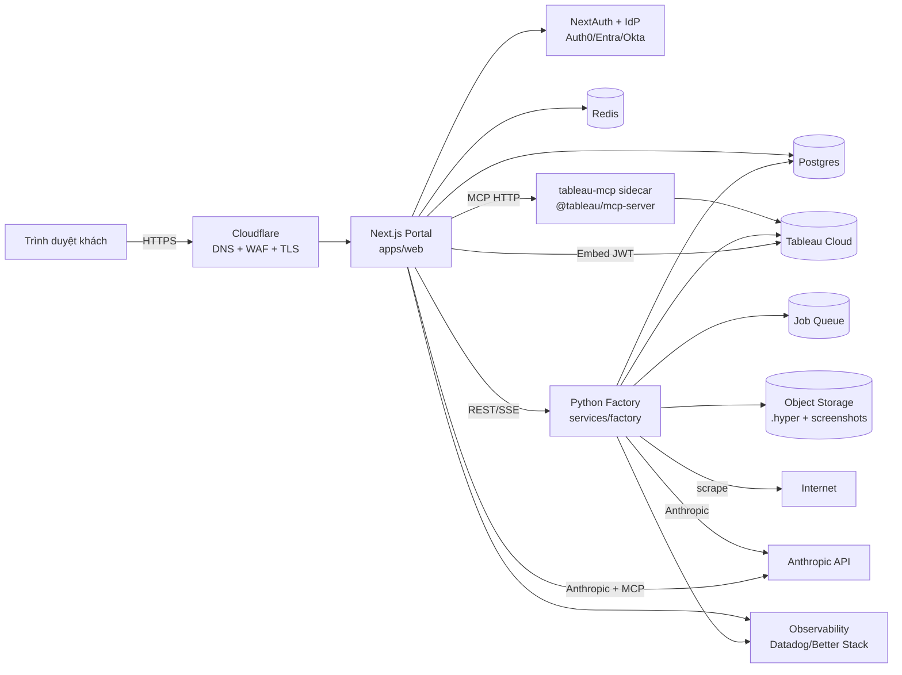

# Kế hoạch Rollout Production — `tableau-ai-portal`

> Tài liệu này tổng hợp **toàn bộ dịch vụ / hạ tầng / phụ thuộc bên ngoài** cần thiết để đưa dự án từ trạng thái hiện tại (Phases 0–11 đã xong) lên production cho một team **mức trung bình đến lớn**. Mỗi mục đều có khuyến nghị vendor cụ thể và lý do.
>
> Nếu bạn là team 2–4 người và muốn tiết kiệm chi phí tối đa, đọc [`rollout-production-lean.md`](./rollout-production-lean.md) thay vào đó.
>
> Nếu chỉ chạy local cho dev / demo nội bộ, đọc [`local-development.md`](./local-development.md).

---

## 1. Bản đồ tổng quan kiến trúc production

Có **5 thành phần chạy động** cần host: `apps/web`, `services/factory`, `tableau-mcp` sidecar, Postgres, Redis. Tất cả còn lại là SaaS bên ngoài.

---

## 2. Compute / Hosting (nơi mỗi service chạy)

| Thành phần | Yêu cầu kỹ thuật | Khuyến nghị | Vì sao |
|---|---|---|---|
| `apps/web` (Next.js 15) | Node runtime (không phải Edge — cần `child_process` cho MCP fallback, SSE giữ kết nối lâu, ký HS256 JWT, `jose`), App Router + RSC | **Vercel** (gói Pro) hoặc **Fly.io / Railway** | Vercel có hỗ trợ Next 15 tốt nhất, preview deploys miễn phí mỗi PR. Fly.io rẻ hơn ~3× khi traffic cao và cho phép chạy chung VPC với factory. |
| `services/factory` (FastAPI + Hyper API) | Linux **x86_64** (binary `tableauhyperapi` chưa hỗ trợ ARM cho production), CPU 2–4 vCPU, RAM 4–8 GB, có quyền chạy Playwright (Chromium), job có thể chạy **3–5 phút** | **Fly.io machines** (`size shared-cpu-4x`, region `iad`/`sin`) hoặc **AWS ECS Fargate** | Fly.io hỗ trợ machines luôn chạy + scale-to-zero, mount volume cho cache template. Tránh Vercel/Cloud Run vì giới hạn request timeout 60–300 s sẽ giết job. |
| `tableau-mcp` (sidecar HTTP) | Node 22, port 8081, stateful long-lived process, cần ENV `TABLEAU_PAT_*` | **Cùng cluster Fly.io** với factory (private network) | Giữ nội bộ — không expose ra Internet. Chỉ `apps/web` và `services/factory` mới gọi qua hostname nội bộ (`http://tableau-mcp.internal:8081`). |
| Agent orchestrator | Hiện đang nằm trong `/api/chat` của Next.js | **Giữ in-process trong Phase 11** | Khi traffic > ~50 RPS hoặc cần parallel tool-call lớn thì tách ra Node service riêng (Fly.io machine) — chưa cần ngay. |

**Cấu hình tối thiểu khi GA:**
- Web: 2 instance (HA), 1 vCPU / 1 GB mỗi instance.
- Factory: 2 machines + autoscale theo job queue depth, dừng về 0 khi rảnh.
- tableau-mcp: 1 instance (đủ vì stateless toward Tableau Cloud).

---

## 3. Tableau Cloud (phụ thuộc SaaS lõi)

| Hạng mục | Hành động cần làm trước GA |
|---|---|
| **Site provisioning** | 3 site riêng: `dev`, `staging`, `prod` (hoặc tối thiểu 2: `staging` + `prod`). Mỗi site có **Connected App riêng** với secret riêng. Không được dùng chung secret giữa các môi trường. |
| **Connected App — Direct Trust** | Tạo trên từng site; bật **Domain Allowlist** chứa đầy đủ: `*.vercel.app` (cho preview), `staging.tableau-portal.com`, `app.tableau-portal.com`. Mỗi domain mới phải được thêm trước khi deploy. |
| **Site setting bắt buộc** | "**Enable capture of user attributes in authentication workflows**" — bật ở tất cả site. Nếu quên, `USERATTRIBUTE("TenantId")` trong workbook sẽ trả NULL và RLS sẽ fail-open. |
| **License model** | **Usage-Based Licensing (UBL / Analytical Impressions)** — đã chốt. Mua gói tối thiểu (10K impressions ≈ $5K/năm) cho pilot, lên 100K cho GA. Theo dõi qua **REST endpoint `/sites/{id}/usageStats`** (cron 1 lần/ngày, ghi vào Postgres). |
| **Service-account user + PAT** | Tạo 1 user `svc-mcp@yourdomain.com` trên mỗi site với role **Site Administrator Creator** (cần để publish workbook + tạo Pulse metric). Sinh **PAT riêng cho từng môi trường**. ⚠️ **PAT hết hạn sau 15 ngày không hoạt động** — phải có cron keepalive (xem mục 7.2). |
| **Project / permissions** | 1 project chung `Tenants`, group `tenant-<id>` per tenant. Data policy `USERATTRIBUTE("TenantId")` enforced ở data source level — đã có pattern, cần script bootstrap khi tạo tenant mới. |
| **Pulse** | Bật ở từng site (Settings → Tableau Pulse). Phải có quota về metric definitions (mỗi tenant ~6–10 metric → tính sẵn dung lượng). |

**Rủi ro phải để ý:** Tableau Cloud có **release cadence ~ mỗi quý** và **API version skew** có thể làm `@tableau/embedding-api-react` hiện đang pin `~3.14.0` lỗi. Cần lịch test trên staging trước mỗi Tableau release.

---

## 4. Anthropic (LLM)

| Hạng mục | Khuyến nghị |
|---|---|
| **Workspace** | Tạo **Anthropic Organization** riêng cho company, sau đó **3 workspace** (`dev`, `staging`, `prod`) — mỗi workspace có API key + budget riêng. |
| **Model selection** | Chat agent: `claude-sonnet-4-5` cho cost/quality tốt; fallback `claude-haiku-4-5` cho factory profile step (cost giảm 5×). |
| **Rate limits** | Mặc định Anthropic tier 4. Cần `requests_per_minute ≥ 1000` và `output_tokens_per_minute ≥ 200K` cho GA. Liên hệ Anthropic sales nâng tier khi pilot. |
| **Cost budget** | Đặt **monthly spend cap** ở workspace level. Pilot: $500–1000/tháng. Add Slack alert qua webhook khi >80%. |
| **Native MCP** | Production phải truyền `mcp_servers` trong API call (đã có code) — nhớ `authorization_token` được mint riêng và đổi mỗi request. |

---

## 5. Identity & Access (IdP cho end-user)

NextAuth hiện đang dùng **Credentials provider dev-only** (`apps/web/app/(auth)`) — **KHÔNG được phép lên prod**. Bắt buộc thay thế trước pilot.

| Lựa chọn | Khi nào dùng | Trade-off |
|---|---|---|
| **Auth0** (Okta) | Khách hàng SMB / multiple tenant với nhiều IdP khác nhau | Dễ setup nhất, sẵn social + SAML + Enterprise SSO. ~$240/tháng cho 1000 MAU. |
| **Microsoft Entra External ID** | Khách hàng enterprise sẵn dùng Microsoft 365 | Rẻ hơn Auth0 ở scale lớn (~$0.01–0.03/MAU). Tốt cho B2B SaaS. |
| **WorkOS** | Cần ship SSO/SAML cho enterprise tenants nhanh | Đắt nhất nhưng có "SSO-as-a-Service" + SCIM provisioning sẵn. |
| **Internal admin** (cho team `admin/`) | Người trong công ty | Dùng **Google Workspace OIDC** hoặc Entra (cùng IdP dùng cho công ty). Tách provider khỏi customer IdP. |

**Cấu hình NextAuth production cần có:**
- `AUTH_SECRET` riêng từng môi trường (32 byte random).
- `AUTH_TRUST_HOST=true` (sau proxy Cloudflare).
- Session strategy: `database` (lưu vào Postgres) thay vì JWT cookie → để revoke được session khi xóa user.
- Map `session.user.tenantId` + `session.user.role` từ IdP claim → đưa vào JWT mint cho Tableau.

---

## 6. Data stores

### 6.1 Postgres (relational)

**Schema bắt buộc trước GA (Phase 11 deliverable):**

| Bảng | Mục đích |
|---|---|
| `tenants` | `id`, `slug`, `display_name`, `industry`, `tableau_group_id`, `theme_json`, `created_at`, `archived_at`, `impression_cap` |
| `users` | NextAuth user + `tenant_id` + `role` |
| `accounts`, `sessions`, `verification_tokens` | NextAuth schema chuẩn |
| `audit_log` | `id`, `ts`, `tenant_id`, `user_id`, `event_type`, `tool_name`, `datasource_id`, `prompt_hash`, `latency_ms`, `outcome` — đã emit JSON, cần persist |
| `factory_jobs` | `id`, `tenant_id`, `url`, `status`, `current_step`, `error`, `profile_json`, `created_at` |
| `impression_counters` | `tenant_id`, `date`, `count`, `cap` — daily bucket |
| `pulse_metrics` | per-tenant registry of Pulse metric IDs (để admin UI list & delete được) |
| `tableau_pat_keepalive` | `last_used_at` per env — log cron keepalive |

**Khuyến nghị vendor:**

| Vendor | Khi nào chọn |
|---|---|
| **Neon** (serverless Postgres) | Mặc định khuyên dùng. Branching DB per PR preview free. ~$25/tháng start. Hợp Vercel deploys. |
| **Supabase** | Nếu muốn kèm Storage + Auth + Realtime gộp 1 chỗ. ~$25/tháng. |
| **AWS RDS / Aurora** | Khi cần compliance HIPAA/SOC2 chính thức và đã có VPC AWS. |
| **Fly Postgres** | Nếu app chính trên Fly.io, giảm latency. Phải tự lo backup. |

**Migrations:** dùng **Prisma Migrate** (hợp NextAuth) hoặc **Drizzle Kit**. Đưa vào CI bắt buộc trước deploy.

### 6.2 Redis

**Mục đích bắt buộc:**
- Rate limit per-tenant per-user (đang in-memory → Phase 11 thay sang Redis cho cross-instance accuracy).
- **Impression counter** cross-instance (chống race condition khi web có 2+ replica).
- **Job queue** cho factory (BullMQ broker).
- Cache phiên ngắn cho metadata dài (`get-datasource-metadata` 5 phút TTL).

**Khuyến nghị:** **Upstash Redis** (serverless, pay-per-request, regional / global replication) — đơn giản nhất. Hoặc **Redis Cloud** / **Fly Redis** nếu đã có cluster Fly.io.

### 6.3 Object Storage

| Mục đích | Khuyến nghị |
|---|---|
| `.hyper` files (~5–15 MB / demo) trước khi publish lên Tableau (làm staging buffer, retry, audit) | **Cloudflare R2** (không có egress fee) hoặc **AWS S3** |
| Screenshots brand extraction (Playwright PNG) | Same |
| Audit log archive (>90 ngày) | Same |
| Backup Postgres dump | Same — bật **lifecycle policy** Glacier sau 30 ngày |

R2 rẻ hơn S3 nhiều cho dự án này vì không có egress charge khi serve lại file.

---

## 7. Background processing

### 7.1 Job queue cho Factory

Pipeline scrape → profile → gen → publish chạy **3–5 phút** → bắt buộc async, không thể chạy trong HTTP request.

| Lựa chọn | Trade-off |
|---|---|
| **BullMQ trên Upstash Redis** | Node producer (apps/web) ↔ Python consumer cần wrapper. Đơn giản nhất nếu giữ Redis. |
| **Inngest** | Step-function DAG sẵn cho pipeline 14 bước, có UI debugging, retry/observability built-in. Khuyến nghị mạnh cho factory vì pipeline đa bước, mỗi bước nên là `step`. |
| **AWS SQS + Lambda worker** | Khi đã chọn AWS toàn diện. |
| **Cloud Tasks (GCP)** | Khi trên GCP. |

**Khuyến nghị: Inngest** — pipeline factory map 1:1 vào `step.run("scrape")`, `step.run("profile")`, ..., tự retry per step, có replay UI rất hợp Phase 9 confirm-before-build.

### 7.2 Cron jobs (scheduled)

| Cron | Tần suất | Mục đích |
|---|---|---|
| **Tableau PAT keepalive** | Mỗi 7 ngày | Gọi `/api/3.x/sites` với PAT để giữ PAT khỏi expire 15 ngày |
| **Impression usage poll** | Mỗi 1 giờ | Lấy số impression từ Tableau Cloud `/usageStats`, đối chiếu vào `impression_counters` để hiện cho tenant admin |
| **Secret rotation reminder** | Hàng tuần | Slack ping nếu `connected_app_secret` đã > 90 ngày |
| **Cleanup factory_jobs** | Hàng đêm | Xóa job records `status=failed` > 30 ngày |
| **Archive audit_log** | Hàng tuần | Export rows > 90 ngày sang R2/S3, xóa khỏi Postgres |
| **Pulse insight refresh trigger** | Daily 6am | Đảm bảo cards mới khi user login sáng |

Chạy bằng **Vercel Cron** (free đến 100 jobs) hoặc **Inngest Schedules** (đã có nếu chọn Inngest).

---

## 8. Secret management

**Secrets phải vào vault, KHÔNG `.env`:**

| Secret | Rotation cadence |
|---|---|
| `TABLEAU_CONNECTED_APP_CLIENT_ID` / `_SECRET_ID` / `_SECRET_VALUE` | 90 ngày |
| `TABLEAU_PAT_NAME` / `_PAT_SECRET` (service account) | 180 ngày + keepalive 7 ngày |
| `ANTHROPIC_API_KEY` | 90 ngày |
| `AUTH_SECRET` (NextAuth) | 365 ngày (cần revoke session khi rotate) |
| `DATABASE_URL` (Postgres) | 90 ngày |
| `REDIS_URL` | Khi cần |
| `S3_ACCESS_KEY` / `_SECRET_KEY` | 90 ngày |
| IdP client secret (Auth0/Entra) | 365 ngày |
| Sentry DSN, Datadog API key | 365 ngày |

**Khuyến nghị vendor:**

| Vendor | Khi nào |
|---|---|
| **Doppler** | Đơn giản nhất, có CLI tốt cho local dev + sync sang Vercel/Fly. $7/người/tháng. Mặc định khuyên. |
| **1Password Secrets Automation** | Nếu team đã dùng 1Password. |
| **AWS Secrets Manager** | Nếu trên AWS sẵn. |
| **Infisical** (OSS) | Self-host nếu cần compliance. |

**Bắt buộc:** hook `secret-scan.sh` của `.claude/hooks/` đã chặn commit có PAT, **giữ và mở rộng** thêm regex cho production secret formats.

---

## 9. Observability (cực kỳ quan trọng do agent stateful + cost)

| Tầng | Khuyến nghị | Mục đích cụ thể |
|---|---|---|
| **Logs (structured JSON)** | **Better Stack** (cheap) hoặc **Datadog** (enterprise) | Audit log đã emit JSON sẵn → ship qua Vector/Fluent Bit. Index theo `tenant_id`, `tool_name`, `prompt_hash`. |
| **Metrics** | **Datadog** hoặc **Grafana Cloud** | Custom metrics: `tableau.impressions.{tenant_id}`, `anthropic.tokens.{model,workspace}`, `factory.stage.duration_ms{stage}`, `mcp.tool_call.latency{tool}`, `chat.tool_loop.iterations`. |
| **Tracing (OpenTelemetry)** | **Honeycomb** hoặc **Datadog APM** | Trace 1 chat turn = root span → `Anthropic.messages.stream` → `mcp.query-datasource` → ... Cần để debug "why slow". |
| **Error tracking** | **Sentry** | Browser + Node + Python (FastAPI). Tách project riêng cho `apps/web` và `services/factory`. |
| **Uptime / Synthetic** | **Better Stack Uptime** hoặc **Checkly** | 3 checks tối thiểu: (1) `GET /api/health`, (2) embed flow end-to-end (Playwright synthetic load 1 demo tenant), (3) chat flow (`POST /api/chat` câu chuẩn → expect tool call). |
| **Cost dashboard** | Datadog / Grafana | Anthropic token spend (per-tenant), Tableau impression burn rate, factory job concurrency. |
| **Alerts** | PagerDuty / Slack | 5xx > 1% / 5 phút; impression > 80% cap / tenant; Anthropic budget > 80%; PAT keepalive fail; queue depth > 50. |

**Combo tiết kiệm:** Better Stack (logs + uptime) + Sentry (errors) + Honeycomb free tier (traces) ≈ $50–100/tháng tổng.

---

## 10. Networking & Security

| Hạng mục | Khuyến nghị |
|---|---|
| **DNS** | **Cloudflare DNS** — miễn phí, hỗ trợ ALIAS, fast propagation |
| **TLS** | Tự động qua **Cloudflare** (proxy mode) hoặc Vercel/Fly built-in (Let's Encrypt) |
| **WAF** | **Cloudflare WAF** — bật OWASP rules + bot fight mode + rate limit ở edge (1000 req/min/IP cho `/api/chat`) |
| **CSP (Content-Security-Policy)** | **Bắt buộc viết thêm vào `next.config.ts`** — hiện chỉ có `X-Frame-Options: DENY`. Phải cho phép `frame-src https://*.online.tableau.com`, `connect-src` chứa Tableau Cloud + Anthropic, `script-src 'self' 'unsafe-inline'` (Tableau embed yêu cầu), `img-src` chứa Tableau viz + logo bucket. Test thật kỹ vì Tableau embed dễ bị CSP chặn. |
| **Tableau Cloud Domain Allowlist** | Phải chứa **mọi prod + preview host**. Mỗi PR preview của Vercel sinh URL mới `*.vercel.app` → hoặc dùng wildcard `*.vercel.app` (rủi ro) hoặc chỉ enable preview JWT trên `dev` site. **Khuyến nghị:** preview deploys chỉ kết nối `dev` Tableau site, không kết nối `prod`. |
| **Egress** | Factory cần outbound HTTPS tới: **bất kỳ domain nào** (scrape customer URL), Anthropic, Tableau Cloud. Không khóa egress được; thay vào đó dùng **per-request URL allowlist + SSRF guard** trong scrape.py (chặn IP private, metadata IP `169.254.169.254`). |
| **Network isolation** | tableau-mcp KHÔNG được expose Internet. Đặt trên private network của Fly.io / VPC. Bind `127.0.0.1` hoặc `*.internal`. |
| **mTLS giữa services** | Optional Phase 12. Cloudflare Tunnel / Tailscale cho tableau-mcp dễ hơn. |

---

## 11. Email & Notifications

| Use case | Vendor |
|---|---|
| Transactional (invite, factory done, billing alert) | **Resend** (đơn giản, DX tốt) hoặc **Postmark** (deliverability top). $20/tháng tier khởi đầu. |
| Ops alerts | **Slack webhook** + **PagerDuty** cho on-call. |
| Tenant in-app notifications | Phase sau, dùng Postgres + WebSocket — chưa cần GA. |

---

## 12. CI/CD

### Pipeline GitHub Actions

| Stage | Jobs |
|---|---|
| **PR opened** | lint (`pnpm lint`), typecheck (`pnpm typecheck` + `uv run mypy`), unit test (`pnpm test` + `pytest`), template contract tests (Phase 8 đã có), secret scan, **security-reviewer subagent** chạy diff review |
| **PR merge → staging** | Build Docker images (web, factory, tableau-mcp), push GHCR, deploy staging, run E2E (Playwright) |
| **Promote staging → prod** | Manual approval gate, blue/green deploy hoặc canary 10% / 50% / 100% (Vercel hỗ trợ sẵn rolling) |

### Container Registry

- **GHCR** (GitHub Container Registry) — mặc định, miễn phí với repo private.
- **AWS ECR** nếu deploy chính sang AWS.

### Preview deploys

- **Vercel preview** tự sinh per PR cho `apps/web`.
- Factory không cần preview per PR (quá tốn) — chỉ deploy lên `staging` sau merge.

### Migrations & rollback

- Postgres migrations chạy ở **pre-deploy hook**, không trong code app.
- Tag mỗi release `vX.Y.Z` để rollback nhanh.
- **Tableau template versioning**: gắn version vào file name (`retail-ecommerce-v1.2.twb`), không overwrite — tránh tenant cũ vỡ.

---

## 13. Cost & Licensing — budget mẫu cho pilot

| Khoản | Cost / tháng (USD) |
|---|---|
| Tableau Cloud UBL (10K impressions/year) | ~$420 (split annual) |
| Anthropic API (pilot, ~5 tenant) | $300–600 |
| Vercel Pro | $20 |
| Fly.io (factory 2 machines + tableau-mcp + Postgres dev) | $80–150 |
| Neon Postgres production tier | $25 |
| Upstash Redis | $10–30 |
| Cloudflare R2 (50 GB) | $1 |
| Auth0 (1000 MAU) | $240 |
| Sentry team | $26 |
| Better Stack (logs + uptime) | $34 |
| Doppler secrets | $7 |
| Cloudflare (DNS + WAF) | $20 |
| Resend email | $20 |
| **Tổng pilot** | **~$1,200–1,700 / tháng** |

GA (50+ tenant, 100K impression/năm) sẽ scale Tableau (~$2K/tháng) + Anthropic (~$2–5K/tháng) là 2 cost driver lớn nhất.

---

## 14. Compliance / Legal

| Hạng mục | Hành động |
|---|---|
| **Healthcare synthetic banner** | Đã enforce trong template — giữ và thêm test guard ở contract test |
| **GDPR (nếu khách EU)** | DPA với Tableau (mặc định), Anthropic (mặc định), Vercel/Fly. Postgres region EU (Neon hỗ trợ `eu-central-1`) |
| **DPA** | Lấy DPA từ Anthropic + Tableau trước pilot có khách EU |
| **Backup / DR Postgres** | Neon point-in-time recovery 7 ngày (Pro plan). Thêm `pg_dump` nightly → R2 retention 90 ngày |
| **DR Tableau Cloud** | Không backup được dashboards bằng API; phải **export workbook .twbx** định kỳ (cron) lưu R2 — đặc biệt với tenants Pulse metric (REST GET tất cả definitions) |
| **Audit retention** | Audit log persist Postgres 90 ngày, archive R2 7 năm (nếu khách finance/healthcare) |
| **Trademark** (Demo Factory) | Banner "Demo for {customer-name}" + TTL/archive flow (Phase 11 admin UI) |

---

## 15. Chiến lược Rollout theo giai đoạn

### Giai đoạn 1 — **Dev** (đang là now)
- Local docker-compose + `pnpm dev` + Tableau Cloud dev site.
- Credentials provider OK ở đây.

### Giai đoạn 2 — **Staging** (target T+2 tuần)
- Deploy Web + Factory + tableau-mcp lên Fly.io/Vercel.
- Tableau **staging site** riêng, Connected App riêng.
- Real IdP (Auth0 sandbox).
- Postgres staging (Neon branch), Redis (Upstash dev).
- Toàn bộ secret qua Doppler.
- Synthetic check chạy 24/7.
- **Tiêu chí pass:** factory build 1 demo retail < 5 phút, chat trả lời "why EMEA revenue down" có tool-call thực, audit log persist, không lỗi 5xx 48h liên tục.

### Giai đoạn 3 — **Internal soft launch** (T+4 tuần)
- Mở cho team nội bộ (5–10 user).
- **Impression cap mặc định 2000/tenant/day**.
- Đo Anthropic cost / user, calibrate budget.
- Bật full observability stack.

### Giai đoạn 4 — **External Pilot** (T+6 tuần)
- 1–3 tenant ngoài, hợp đồng pilot ngắn (30 ngày), impression cap **thấp** (500/day).
- DPA ký xong.
- Có on-call rotation Slack + PagerDuty.
- Đăng ký Tableau UBL bucket chính thức.

### Giai đoạn 5 — **General Availability** (T+10 tuần)
- Hoàn tất **Phase 10 + 11** (brand extraction + tenant admin UI + Redis-backed counters).
- Tăng impression cap tùy plan tenant.
- SLA 99.5%, RPO 1h, RTO 4h.

---

## 16. Công việc kỹ thuật còn lại BẮT BUỘC trước GA

Đây là danh sách "blocker" rút từ plan + repo:

| # | Hạng mục | Phase | Severity |
|---|---|---|---|
| 1 | **Real IdP integration** thay credentials provider | New | **Blocker** — không lên prod được |
| 2 | **Postgres schema + migrations** production (Prisma/Drizzle) | Phase 11 | **Blocker** |
| 3 | **Redis-backed rate limiter + impression counter** | Phase 11 | **Blocker** (race condition multi-instance) |
| 4 | **Full Content-Security-Policy** trong `next.config.ts` | New | **Blocker** (security review) |
| 5 | **Tenant admin UI** (list/archive/delete/rebrand) | Phase 11 | High |
| 6 | **PAT keepalive cron** | New | High (PAT expire = service down) |
| 7 | **Impression usage poll cron** + dashboard | Phase 11 | High |
| 8 | **Job queue (Inngest/BullMQ)** thay subprocess thẳng | Phase 11 | High (factory hiện không HA) |
| 9 | **SSRF guard** trong `scrape.py` | New | High (security) |
| 10 | **Sentry + OpenTelemetry instrumentation** | New | Medium |
| 11 | **Backup DR runbook** (Postgres + Tableau workbook export) | New | Medium |
| 12 | **Audit log persistence** (hiện chỉ log JSON stdout) | New | Medium |
| 13 | **Vision-based brand extraction** | Phase 10 | Medium (UX, không blocker) |

---

## 17. Stack khuyến nghị "ngắn gọn" cho team nhỏ (TL;DR)

Nếu chỉ chọn **1 vendor mỗi tầng** để khởi động nhanh:

| Tầng | Vendor |
|---|---|
| Web hosting | **Vercel Pro** |
| Python factory + tableau-mcp sidecar | **Fly.io** |
| Postgres | **Neon** |
| Redis | **Upstash** |
| Object storage | **Cloudflare R2** |
| Job queue | **Inngest** |
| Auth (customer) | **Auth0** |
| Secrets | **Doppler** |
| DNS + WAF + TLS | **Cloudflare** |
| Logs + uptime | **Better Stack** |
| Errors | **Sentry** |
| Email | **Resend** |
| Alerts | **PagerDuty** (free tier) + **Slack webhook** |
| CI/CD | **GitHub Actions** + **GHCR** |

Tổng chi phí pilot: ~**$1,200–1,700/tháng** (chưa kể nhân sự). Mọi thứ đều có free / starter tier để bật staging trong < 1 ngày.

---

Khi sẵn sàng kick off rollout, bước đầu tiên nên làm là **provision staging environment** (Tableau staging site + Connected App + Auth0 tenant + Neon DB + Doppler) trong 1 sprint, rồi mới wire toàn bộ secret vào Vercel/Fly deploy. Phase 11 (Redis + admin UI) có thể chạy song song với việc set up infra.
