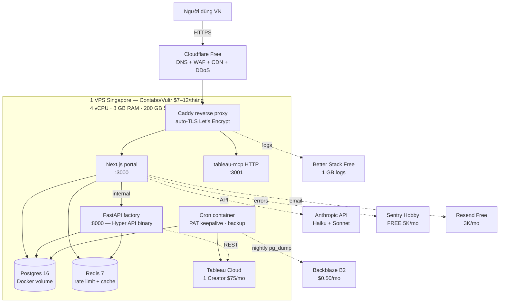
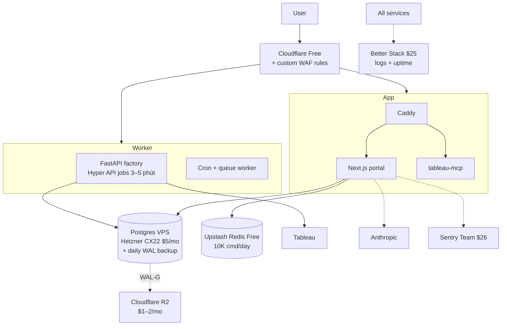
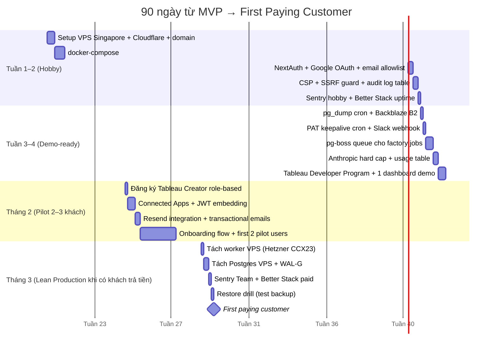

# Kế Hoạch Rollout "Tiết Kiệm Tối Đa" Cho Team 2–4 Người

> TL;DR: Bạn có thể vận hành toàn bộ stack trên **1 VPS Singapore $7–12/tháng** + Cloudflare free + Sentry hobby + GitHub Actions free, **tổng infra ~$15–30/tháng** ở mức hobby, và **~$70–120/tháng** ở mức lean-production. Chi phí *bắt buộc không thể cắt* là **Tableau Cloud (~$75/Creator/tháng)** và **Anthropic API (~$30–150/tháng tùy traffic)** — đây là 2 thứ chiếm phần lớn ngân sách thật.
>
> Nếu chỉ chạy local cho dev/demo, xem [`local-development.md`](./local-development.md) (rẻ hơn nữa).
>
> Nếu cần production-grade cho team lớn, xem [`rollout-production-full.md`](./rollout-production-full.md).

---

## 1. Hai Tier Chi Phí — So Sánh Nhanh

| Hạng mục | **Hobby ($15–30/tháng infra)** | **Lean Production ($70–120/tháng infra)** | Plan gốc (Pilot $1,200–1,700) |
|---|---|---|---|
| Mục tiêu | 1 dev, 1–2 khách demo, chấp nhận downtime | Team 2–4, 5–20 khách thật, có uptime cơ bản | Team 5+, scale, paying customers |
| Compute | 1 VPS Contabo/Vultr SGP | 1 VPS dedicated CPU + 1 VPS DB nhỏ | Vercel Pro + Fly.io machines |
| DB | Postgres self-hosted (Docker) | Postgres self-hosted có replica HOẶC Supabase Pro | Neon Scale |
| Redis | Self-hosted (Docker) | Self-hosted hoặc Upstash free | Upstash paid |
| Auth | NextAuth + Google OAuth (free) | + email allow-list + audit log | Auth0/WorkOS |
| Email | Resend free (3K/tháng) | Resend Pro $20 (50K) | Resend Business |
| Logs/APM | Sentry hobby + Better Stack free | Sentry Team $26 + Better Stack $25 | Sentry + Datadog/Better Stack paid |
| WAF/CDN | Cloudflare Free + Caddy | Cloudflare Free + custom rules | Cloudflare Pro/Business |
| Backup | `pg_dump` → Backblaze B2 (~$0.50) | + WAL-G → R2 (~$2) | Neon PITR + S3 |
| Queue | pg-boss trong Postgres | BullMQ trên Redis | Inngest paid |
| Secrets | `.env` trên VPS + 1Password chia sẻ | Doppler free hoặc Infisical self-host | Doppler Team |
| CI/CD | GitHub Actions free (2,000 min) | GitHub Actions free + Coolify webhook | GH Actions + Vercel + Fly |
| Uptime | Better Stack free (3 monitor) | UptimeRobot/Better Stack paid | PagerDuty |
| **Total infra/tháng** | **~$15–30** | **~$70–120** | ~$400–700 |
| **+ Tableau Cloud** | $75 (1 Creator role-based) | $150–225 (2–3 Creator) | $5K/year UBL |
| **+ Anthropic** | $20–60 (cap cứng) | $60–200 | $300+ |
| **TỔNG THỰC TẾ** | **~$110–165** | **~$280–545** | **~$1,200–1,700** |

> Lưu ý: nếu chỉ cần demo nội bộ (không có khách trả tiền), bạn có thể tạm thời dùng **Tableau Cloud free trial 14 ngày** hoặc **Tableau Developer Program (free 1-year sandbox cho dev)** — đăng ký tại `developer.salesforce.com/free-trial/tableau`. Đây là cách tiết kiệm $75/tháng trong giai đoạn build/demo.

---

## 2. Kiến Trúc Tier Hobby (Single VPS, ~$15–30/tháng infra)



**Đặc điểm:**
- Tất cả service trong 1 file `docker-compose.yml`, deploy qua `git pull && docker compose up -d` hoặc dùng **Coolify** (self-hosted, free) làm UI deploy.
- Caddy tự động cấp & gia hạn TLS qua Let's Encrypt — không cần Nginx config phức tạp.
- Cloudflare đặt trước Caddy: bật "Full (strict)" SSL, bật **Cloudflare Tunnel** nếu muốn ẩn IP gốc (free).
- VPS chọn **Contabo VPS S Singapore** (~$7.50/tháng, 4 vCPU, 8 GB RAM, 200 GB SSD) hoặc **Vultr High Performance Singapore** (~$12/tháng, 2 vCPU, 4 GB, 80 GB SSD) — Singapore vì latency tới VN chỉ ~30 ms, Hetzner DE rẻ hơn nhưng latency ~250 ms.

---

## 3. Kiến Trúc Tier Lean Production (~$70–120/tháng infra)



**Thay đổi so với hobby:**
- Tách app/worker để job factory dài 3–5 phút không block portal.
- Postgres trên VPS riêng để upgrade/restart không ảnh hưởng app.
- Upstash Redis free thay self-hosted (tránh mất rate-limit khi restart app VPS).
- WAL streaming backup thay vì chỉ `pg_dump` đêm.

---

## 4. Xử Lý 8 Mục BLOCKER — Lean Cách Nào?

| # | BLOCKER gốc | Cách lean | Khi nào phải nâng cấp |
|---|---|---|---|
| 1 | Real IdP (NextAuth credentials dev-only) | **NextAuth v5 + Google OAuth + email allow-list** trong `signIn` callback. 2–10 user pilot OK. | Khi khách yêu cầu SAML/SSO → **Logto self-host** ($0, 1 container) hoặc **Clerk free 10K MAU** |
| 2 | Postgres schema + migrations | Bắt buộc làm. **Drizzle** hoặc **Prisma migrate**, Postgres 16 trong Docker, volume + nightly `pg_dump` | Khi >50 GB hoặc cần PITR → Supabase Pro $25 hoặc Neon Scale |
| 3 | Redis rate limiter + impression | Self-host Redis 7 trong Docker, dùng `sliding-window` qua Lua script | Khi multi-instance app → Upstash $0–10/tháng |
| 4 | Full CSP | **KHÔNG SKIP** — config trong Next.js middleware (`next.config.ts` headers) + Caddy. Free. | N/A — luôn cần |
| 5 | PAT keepalive cron | 1 container `cron` với script bash gọi Tableau API mỗi 6 ngày, alert vào Slack webhook nếu fail | Khi >5 PAT cần quản lý → Inngest free 50K runs |
| 6 | SSRF guard | **KHÔNG SKIP** — URL allowlist + `ipaddress.ip_address(...).is_private` check trong factory. Free. | N/A — luôn cần |
| 7 | Audit log persistence | Bảng `audit_log` trong cùng Postgres, append-only, retention 90 ngày. Đơn giản. | Khi cần compliance (SOC2) → BetterStack/Datadog |
| 8 | Job queue | **`pg-boss`** dùng luôn Postgres (zero infra mới) hoặc **BullMQ** trên Redis. | Khi cần fan-out + scheduling phức tạp → Inngest |

**Điều quan trọng:** mục #4 (CSP) và #6 (SSRF) **không được skip** kể cả ở tier hobby — chúng không tốn tiền, chỉ tốn 1 buổi setup, và là rủi ro an ninh nghiêm trọng.

---

## 5. Vercel Hobby — Có Dùng Được Không?

**Câu trả lời ngắn: KHÔNG cho production, được cho preview/staging.**

| Giới hạn Vercel Hobby | Ảnh hưởng tới `tableau-ai-portal` |
|---|---|
| Function timeout 10s (Pro: 60s, Enterprise: 900s) | **Chặn** SSE chat streaming dài, **chặn** factory jobs 3–5 phút |
| Bandwidth 100 GB/tháng | Vừa đủ cho 1–2 khách nhỏ |
| **Không cho commercial use** | **Vi phạm ToS** nếu có khách trả tiền |
| Build minutes 6000/tháng | OK |
| No team members | Solo dev OK, team thì phải Pro $20/seat |

**Khuyến nghị:** self-host Next.js (`next start`) trên cùng VPS qua Docker. Build trên GitHub Actions, push image lên `ghcr.io` (free), VPS pull về. Tận hưởng:
- Không giới hạn function timeout (SSE chat thoải mái)
- Không lo commercial-use ToS
- Tiết kiệm $20–60/tháng (Vercel Pro + team seats)

Nếu vẫn muốn Vercel cho convenience: dùng **Vercel Hobby cho preview deployment branch** (free), production deploy lên VPS.

---

## 6. Supabase — Có Nên Consolidate?

| Tình huống | Khuyến nghị |
|---|---|
| Tier Hobby (1 VPS) | **Không cần** — self-hosted Postgres trong Docker là rẻ nhất ($0 thêm) và bạn đã có VPS rồi. Supabase free chỉ 500 MB DB, dễ chạm. |
| Tier Lean (muốn bớt ops) | **Supabase Pro $25/tháng** đáng cân nhắc: 8 GB DB + PITR 7 ngày + auth + storage. Loại bỏ việc tự backup, tự tune Postgres. |
| Khi nào KHÔNG dùng Supabase | Nếu workload có **JSONB nặng, vector search, hoặc query phức tạp** — bạn cần control instance size. Self-host trên VPS dedicated CPU rẻ hơn. |

**Quan điểm cá nhân:** với team 2–4 người, **Supabase Pro $25/tháng là deal cực tốt** ở tier lean — bạn đổi $25 lấy: managed backup, managed upgrade, auth built-in, storage S3-compatible. Đáng giá 1 ngày dev/tháng.

---

## 7. Anthropic Cost Containment — Cực Quan Trọng

Anthropic là chi phí variable lớn nhất. Chiến lược:

| Stage | Model | Giá input/output (per 1M tokens) | Lý do |
|---|---|---|---|
| Site profiling (extract metadata) | **Claude Haiku 3.5** | $0.80 / $4 | Task đơn giản, structured output |
| Brand extraction từ HTML | **Haiku 3.5** | $0.80 / $4 | Same |
| Schema design suggestion | **Sonnet 4.5** | $3 / $15 | Cần reasoning |
| Chat với user (Tableau Q&A) | **Sonnet 4.5** + **prompt caching** | $3 / $15 (cache hit: $0.30) | Quality matter; cache system prompt giảm 90% |
| Code generation (dashboards) | **Sonnet 4.5** | $3 / $15 | Cần quality |

**Hard caps bắt buộc:**

```typescript
const DAILY_TOKEN_CAP = 5_000_000;
const MONTHLY_USD_CAP = 100;

if (await getUsage() > cap) throw new RateLimitError(...);
```

- Lưu usage trong Postgres `llm_usage(user_id, tokens, cost_usd, ts)`.
- Mỗi request kiểm tra cap trước khi gọi.
- Anthropic dashboard tự nó cũng có usage limit — **set hard limit $100/tháng** trong Anthropic console.
- Bật **prompt caching** cho system prompt dài (cache 5 min hoặc 1h) — tiết kiệm 80–90% với chat.

**Dự trù chi phí Anthropic (10 khách demo, mỗi khách ~50 chat turns/tuần):**
- Profiling: ~$5/tháng
- Chat (có caching): ~$25–40/tháng
- Code gen: ~$10–20/tháng
- **Tổng: $40–65/tháng** ở tier lean

---

## 8. Tableau Cloud — Chiến Lược Tiết Kiệm

| Lựa chọn | Giá | Phù hợp khi |
|---|---|---|
| **Tableau Developer Program** | **FREE 1 năm** | Đang build, demo nội bộ, chưa có khách trả tiền |
| Tableau Cloud trial | Free 14 ngày | Test trước khi mua |
| **Role-based: 1 Creator** | ~$75/tháng | 1 Creator publish, khách view qua **Embedded Analytics + UBL** hoặc **Connected App JWT** |
| Role-based: 1 Creator + 1 Explorer | ~$117/tháng | 2 người trong team cùng build |
| UBL (Usage-Based Licensing) | $5K/năm min ≈ $417/tháng | Chỉ làm khi đã có ≥3 paying customers |

**Khuyến nghị:**
1. Bắt đầu với **Developer Program (free)** trong khi build.
2. Khi có khách demo đầu tiên: **1 Creator role-based + Connected Apps + JWT embedding** — đây là cách rẻ nhất để cho khách "view" dashboard mà không cần mua seat cho từng khách.
3. Chỉ nâng lên UBL khi `MAU × $/MAU < $417/tháng` không còn đúng (thường là ~20 active users).

> Lưu ý quan trọng: bản project gốc dùng `Personal Access Tokens` (PAT). PAT yêu cầu **Creator hoặc Explorer seat**. Viewer seat KHÔNG tạo được PAT. Đây là lý do bạn cần ít nhất 1 Creator.

---

## 9. Cost Table Chi Tiết — Tier Hobby

| Service | Plan | Giá/tháng (USD) | Ghi chú |
|---|---|---|---|
| VPS Contabo Cloud VPS S Singapore | 4 vCPU · 8 GB · 200 GB | **$7.50** | Hoặc Vultr SGP $12 nếu cần performance hơn |
| Domain (.com qua Cloudflare Registrar) | – | **$1** | $10–12/năm at-cost |
| Cloudflare | Free | **$0** | DNS, WAF, CDN, Tunnel |
| Backblaze B2 backup | First 10 GB free | **$0–1** | `pg_dump` nightly |
| Sentry | Developer (Hobby) | **$0** | 5K errors, 10K perf events |
| Better Stack | Free | **$0** | 3 monitors, 1 GB logs |
| GitHub Actions | Free (private repo 2000 min) | **$0** | Đủ cho team 2–4 |
| Resend | Free | **$0** | 3K emails/tháng, 100/day |
| 1Password (secrets sharing) | Free trial or Personal $3 | **$0–3** | Hoặc Bitwarden free |
| **Infra subtotal** | | **~$9–13** | |
| Tableau Developer Program | – | **$0** (1 năm) | Hoặc $75 Creator role-based |
| Anthropic API (capped) | Pay-as-go | **$20–40** | Hard cap $50 |
| **TOTAL nếu Tableau Developer** | | **~$30–55** | |
| **TOTAL nếu Tableau Creator** | | **~$105–130** | |

---

## 10. Cost Table Chi Tiết — Tier Lean Production

| Service | Plan | Giá/tháng (USD) |
|---|---|---|
| Hetzner CCX13 dedicated CPU (app) | 2 vCPU dedicated · 8 GB | **$13** |
| Hetzner CCX23 (worker, factory jobs) | 4 vCPU · 16 GB | **$26** |
| Hetzner CX22 (Postgres) | 2 vCPU · 4 GB · 40 GB | **$5** |
| Cloudflare R2 (backup + assets) | First 10 GB free | **$1–2** |
| Cloudflare Free + custom rules | – | **$0** |
| Sentry Team | – | **$26** |
| Better Stack | Logs + Uptime | **$25** |
| Resend Pro | 50K emails | **$20** |
| Upstash Redis | Pay-as-go (light) | **$0–10** |
| Domain + 1Password Team | – | **$5** |
| GitHub Actions | Free 2000 min | **$0** |
| **Infra subtotal** | | **~$95–120** |
| Tableau Cloud (1 Creator role) | – | **$75** |
| Anthropic API (capped $200) | – | **$60–150** |
| **TOTAL** | | **~$230–345** |

> Nếu muốn rẻ hơn nữa: gộp app+worker thành 1 VPS CCX23 ($26), bỏ Postgres VPS riêng (self-host trên cùng VPS) → infra ~$60/tháng. Đánh đổi: downtime khi restart.

---

## 11. Giữ / Bỏ / Hoãn — So Sánh Với Plan Gốc

| Thành phần plan gốc | Quyết định ở tier Lean | Lý do |
|---|---|---|
| Vercel Pro $20+/seat | **BỎ** — self-host Next.js trên VPS | Tiết kiệm $60+/tháng, không lo SSE timeout |
| Fly.io machines | **BỎ** — chạy factory trên VPS | Tiết kiệm $30–50, đơn giản hơn |
| Neon Scale | **BỎ** — Postgres self-host hoặc Supabase Pro | Tiết kiệm $50+ |
| Upstash paid | **GIỮ** ở tier lean, **BỎ** ở hobby | Self-host Redis OK với 1 VPS |
| Auth0/WorkOS | **BỎ** — NextAuth + Google OAuth | Tiết kiệm $150+/tháng |
| Doppler Team | **HOÃN** — `.env` + 1Password share | Tiết kiệm $20, an toàn nếu rotate đúng |
| Better Stack paid | **GIỮ** ở lean | Cần log centralized khi multi-VPS |
| Sentry paid | **HOÃN** — Sentry hobby trước, upgrade khi >5K err | Free đủ dùng pilot |
| Cloudflare Pro/Business | **BỎ** — Free + custom rules | Đủ cho <10K RPS |
| Resend Business | **HOÃN** — Free → Pro $20 khi cần | |
| Inngest | **BỎ** — pg-boss hoặc BullMQ | Pg-boss zero infra mới |
| PagerDuty | **BỎ** — Better Stack alert + Slack webhook | Tiết kiệm $40+, đủ với team 2–4 |
| Datadog/APM | **BỎ** — structured logs + Sentry perf | Tiết kiệm $100+, đủ ở <10 RPS |
| OpenTelemetry tracing | **HOÃN** | Không cần ở <10 RPS |
| Multi-region | **BỎ** | Single Singapore VPS đủ cho VN/SEA |
| Synthetic monitoring (Checkly) | **THAY** — cron + curl + Slack webhook | Free |
| WAF dedicated | **THAY** — Cloudflare free rules | Đủ cho pilot |

---

## 12. Trade-offs — Rủi Ro Chấp Nhận Ở Tier Lean

1. **Single point of failure**: 1 VPS chết → toàn bộ portal down. Mitigation: snapshot nightly + script restore <30 phút. SLA thực tế ~99.5% (≤3.6h downtime/tháng).
2. **Không HA database**: `pg_dump` chỉ 1 lần/ngày → mất tối đa 24h data nếu disk chết. Mitigation: bật `wal-g` push WAL lên R2 mỗi 15 phút (~$1/tháng thêm).
3. **Auth chỉ Google OAuth**: khách enterprise yêu cầu SAML/SSO sẽ phải chờ. Mitigation: chuẩn bị migration path sang Logto/Clerk khi đến deal đó.
4. **Rate limiter local**: nếu scale ra >1 app instance, rate limit không sync. Mitigation: chỉ scale khi đã chuyển sang Upstash.
5. **Không có dedicated APM**: debug performance issue khó hơn. Mitigation: log structured JSON đầy đủ, Sentry performance free đủ cơ bản.
6. **Audit log trong cùng DB**: nếu DB compromise thì audit log cũng vô nghĩa. Mitigation: write-only role cho audit, đẩy log ra Better Stack mỗi giờ.
7. **Anthropic cost spike**: 1 user lạm dụng có thể đốt $500/đêm nếu không cap. Mitigation: **bắt buộc** hard cap + alert >$5/giờ.
8. **Backup chưa test restore**: nhiều team có backup nhưng không bao giờ restore thử. Mitigation: **cron monthly** auto-restore lên staging DB và check row count.
9. **Secret rotation thủ công**: PAT, Anthropic key rotate bằng tay. Mitigation: lịch nhắc trong Linear/Notion mỗi 90 ngày.
10. **TLS dựa vào Caddy + Let's Encrypt**: nếu Caddy down lúc renew, cert hết hạn. Mitigation: monitor cert expiry với Better Stack (free).

---

## 13. Scale-up Triggers — Khi Nào Phải Upgrade?

| Tín hiệu | Action | Chi phí thêm |
|---|---|---|
| Postgres DB >5 GB hoặc query p95 >500ms | Tách Postgres ra VPS riêng hoặc Supabase Pro | +$5–25/tháng |
| Factory jobs queue >50 đồng thời | Thêm worker VPS, chuyển sang BullMQ + Upstash | +$15–25/tháng |
| Active users >50 concurrent | Tách Next.js sang VPS riêng | +$13/tháng |
| Anthropic spend >$200/tháng 3 tháng liên tiếp | Negotiate Anthropic Scale/Enterprise, thêm prompt caching | Net giảm 30% |
| Sentry errors >5K/tháng | Sentry Team $26 | +$26 |
| Email >3K/tháng | Resend Pro $20 | +$20 |
| 1 khách enterprise yêu cầu SSO/SAML | Deploy Logto self-host hoặc Clerk Pro | $0–25/tháng |
| Khách yêu cầu SOC2/HIPAA | Migrate lên AWS/GCP, thuê compliance consultant | +$500+/tháng |
| Downtime gây mất khách | Multi-VPS với HAProxy + Postgres streaming replica | +$30/tháng |
| Cần ≥99.9% SLA | Vercel Pro + Neon Scale + PagerDuty (back tới plan gốc) | +$500+/tháng |
| Bandwidth >2 TB/tháng | Cloudflare cache aggressive, hoặc R2 cho assets | $5–20 |
| Multi-region (khách EU/US) | Fly.io regions hoặc duplicate VPS + Cloudflare load balance | +$30+/tháng |

---

## 14. Phased Plan Cụ Thể — 90 Ngày Đầu



---

## 15. Khuyến Nghị Cuối Cho Team 2–4 Người

**Tháng 1–2 (build/demo):** đi tier **Hobby ~$30–55/tháng** (Tableau Developer free). Chỉ 1 VPS Contabo Singapore, mọi thứ docker-compose. Tập trung product, không tốn 1 phút cho ops phức tạp.

**Tháng 3 (khi ký được khách đầu):** upgrade lên **Lean Production ~$280–345/tháng** total. Lúc này khách trả ≥$500–1000/tháng nên ROI dương.

**3 nguyên tắc vàng cho team nhỏ:**

1. **"Boring infra, exciting product"** — đừng dùng K8s, đừng micro-service. 1 docker-compose là đủ cho 100 khách đầu.
2. **"Hard caps everywhere"** — Anthropic, Tableau API, email, request rate. Một bug trong code có thể đốt $1K/đêm nếu không cap.
3. **"Backup không test = không backup"** — schedule restore drill 1 lần/tháng vào lịch team. Đây là rủi ro #1 thực tế.

**3 thứ KHÔNG ĐƯỢC tiết kiệm dù tier nào:**
- CSP headers (free, 1 buổi setup)
- SSRF guard trong factory (free, 1 buổi setup)
- Anthropic hard cap (free, 2 giờ code)

**Vendor-specific cho VN:**
- Thanh toán quốc tế: **Wise** hoặc thẻ tín dụng VPBank/Techcombank quốc tế (đa số work)
- Latency tốt từ VN: **Vultr Singapore, Contabo Singapore, DigitalOcean SGP1** — tránh Hetzner DE cho user-facing (~250 ms RTT)
- Backup region: **Cloudflare R2** (free egress) hoặc **Backblaze B2** (rẻ nhất) — đều có region Singapore/US-West

Khi cần upgrade từng phần, follow bảng scale-up triggers ở mục 13 — đừng upgrade preemptively, chỉ làm khi metric cụ thể vượt ngưỡng.
